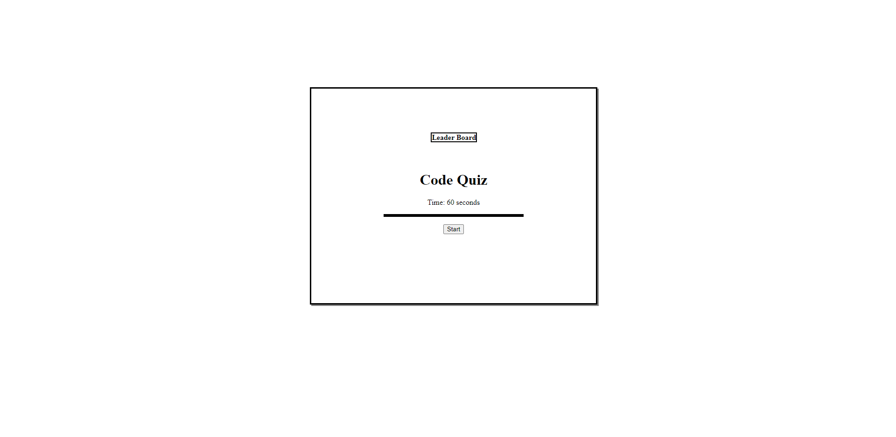

# Code-Quiz

## Description
This webpage contains a timed quiz over JavaScript functions and methods that provides the user a score once completed. The quiz displays one question at a time, only progressing once an answer is selected and ending if the timer runs out which starts at 60 seconds. If the user gets a question incorrect, their time left to complete the quiz is decreased by 10 seconds. Once the user completes all questions, they receive their score and can submit their initials to be displayed in the leaderboard. The leaderboad is accessible through the "Leader Board" link, and will automatically display if a user submits their initials.

## Credit
Thank you to my classmates, Lucas Wysoczanski and Daniel Lee, for partnering with me to work on this challenge. Here are their GitHub profiles--
Lucas Wysoczanski: https://github.com/LucasWyski001
Daniel Lee: https://github.com/drog41813

The quiz questions are sourced from https://www.tutorialspoint.com/javascript/javascript_online_quiz.htm

## Usage

https://micavilla.github.io/code-quiz/